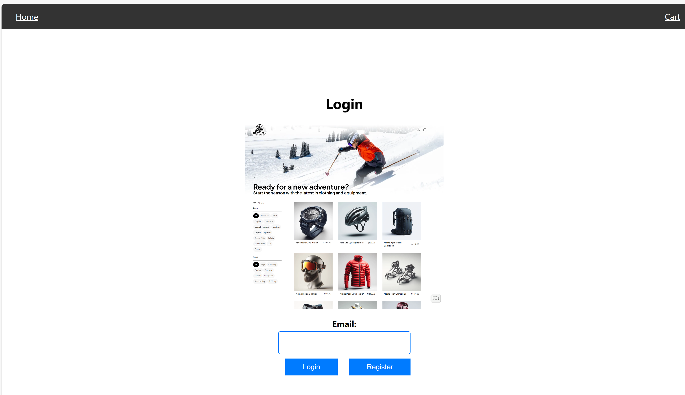
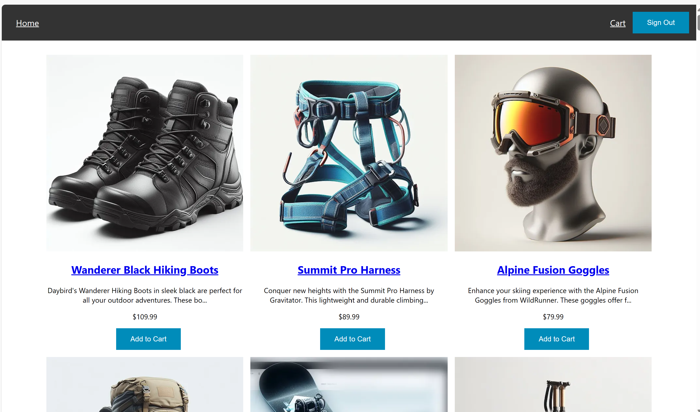
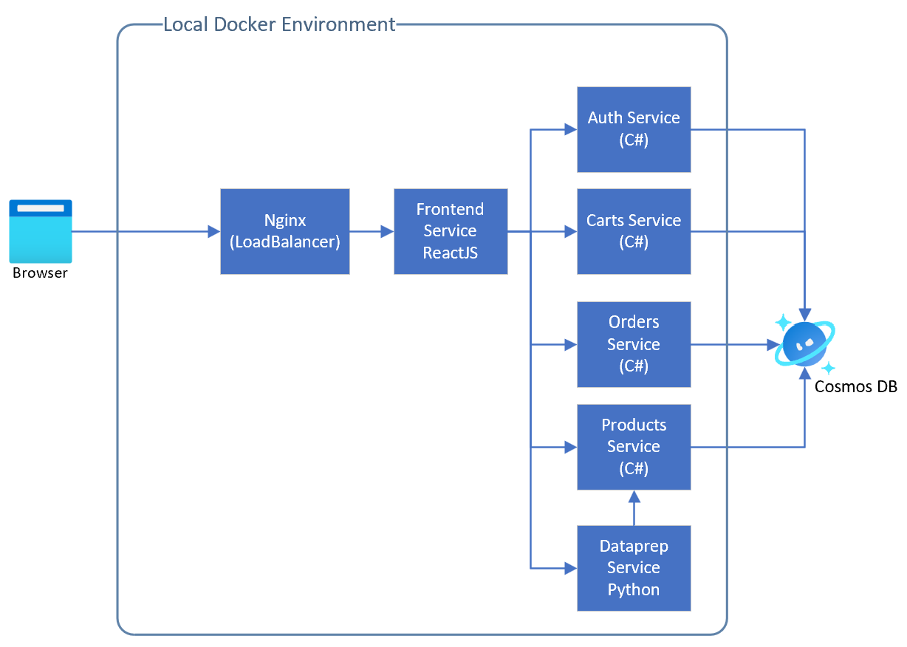

# Simple Ecom

A simple ecommerce application for a levelup training.

This application was developed for the LevelUp workshow that can be found in the [AKS Landing Zone Accelerator's](https://github.com/Azure/AKS-Landing-Zone-Accelerator) [AKS & NoSQL CosmosDB Multiregion](https://github.com/Azure/AKS-Landing-Zone-Accelerator/tree/main/Scenarios/CosmosDB-nosql-Resiliency) scenario.

## Application Architecture

Below is a diagram of the application's architecture when testing it locally.

### Auth Service

This service is responsible for authenticating user and managing the Users collection, which also includes the cart in the database.

### Carts Service

This service is responsible for adding and removing products from the cart and managing the cart within the Users collection

### Products Service

This service is responsible for managing product catalog and inventory.

### Frontend Service

This is responsible for rendering the front end of the application on a web browser.

### Nginx

This is an nginx container that acts as a router and loadbalancer. It is able to perform path based routing. For more information about its configuration, check out its config file

## Prerequisites

1. Azure subscription
1. Docker installation
1. Basic knowledge of containers
1. Basic knowledge of Microservices
1. Basic knowledge of frontend and backend development

## Getting Started

1. Make sure you have docker engine running on your machine
1. Create a Cosmos DB instance on your Azure subscription that allows public network access
1. Head over to Settings -> Keys within your Cosmos DB instance
   Clone the repo
1. Copy the connection string there
1. Open the src\docker-compose.yml file
1. For each of the following services, create a new environment variable called `COSMOSDBOPTIONS__CONNECTION_STRING` and paste that connection string as its value:
   - products
   - carts
   - orders
   - auth
1. CD to the src folder and enter the command `docker-compose up`

This will create the requried containers including an nginx loadbalancer that route traffic to the different services based on the url path. Those 4 services mentioned above would connect to Cosmos DB.

## Accessing the app on the Browser

1. Go on your browser and nagivate to `http://localhost:3050/prepdata/send_data`. This endpoint will automatically populate your cosmosdb with the required products data. It might timeout but that doesnt mean the products were not uploaded.
1. Access the frontend servie on your browser by nagivating to `http://localhost:3050`
1. Click on registration page to create a new user. Then head back to login page to login (this is super insecure and only requires an email address to login. This was made simply for demo purposes only).
1. Test out the app:
   - Open console on your browser to see messages (optional)
   - Add products to your cart
   - Remove products from your cart
   - Click on a product's brand name to navigate to list of products from that brand
   - Click on product name to see the product's detail
   - Delete the product from your catalog if you dont like it :)
   - Click on the `Cart` link on the nav bar to see your cart
   - Click on `Place order` to send the request to the orders service and create an order

## API Doc

To access the back end services' API docs with swagger, hit the following endpoints on your browser with the containers running via docker-compose. You will see the various endpoints you can hit to get data from the database and examples to get said data.

- Orders: http://localhost:8082/swagger/index.html
- Auth: http://localhost:8083/swagger/index.html
- Products: http://localhost:8084/swagger/index.html
- Carts: http://localhost:8085/swagger/index.html

## Deploying your app on Azure Kubernetes Service

Follow the instructions at the [AKS & NoSQL CosmosDB Multiregion](https://github.com/Azure/AKS-Landing-Zone-Accelerator/tree/main/Scenarios/CosmosDB-nosql-Resiliency) scenario to deploy the application to AKS.
